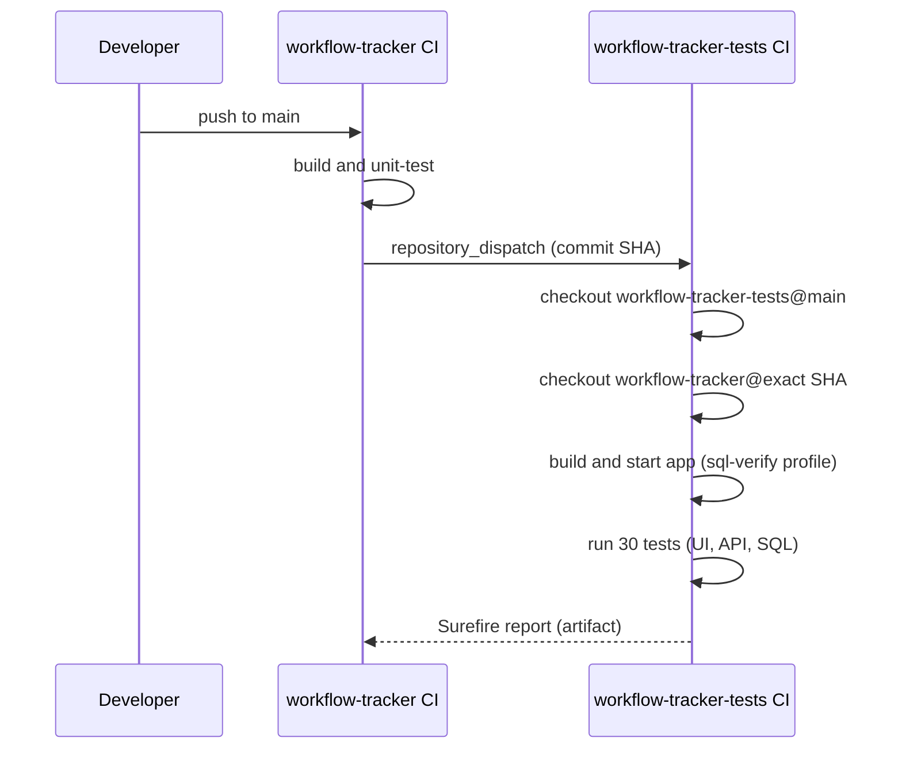
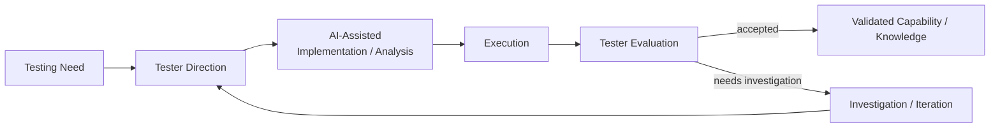

# workflow-tracker-tests

[](https://github.com/frankfulcomer/workflow-tracker-tests/actions/workflows/ci.yml)

A black-box regression suite for [workflow-tracker](https://github.com/frankfulcomer/workflow-tracker)
across three independent testing layers — UI, REST API, and SQL/JDBC —
traceable back to documented Agile acceptance criteria, with its own
cross-repository, exact-commit CI pipeline.

**This repository is the primary artifact of this portfolio project.** The
app under test is a deliberately simple, controllable sandbox; this is
where the QA engineering work actually lives — see **Notable Findings**
below for what that looked like in practice.

## Purpose

Workflow Tracker Tests is a QA proof of concept exploring how an experienced
QA engineer can use **AI-assisted development** to build a maintainable,
layered testing capability around an existing business application.

The project was deliberately approached from a **black-box testing
perspective**. The QA system interacts with the application through externally
observable boundaries — its browser UI, REST API, and read-only database
verification — rather than importing or depending on application
implementation code. This keeps the regression system independent from the
product it verifies and models an approach that can reduce how much proprietary
application code needs to be exposed during AI-assisted QA development.

AI has been used throughout the project as an implementation, investigation,
and learning accelerator — not as a substitute for QA judgment. The tester
defines the behaviors and risks to investigate, establishes expected results,
evaluates testing approaches, reviews and executes generated code, investigates
failures, and determines whether the resulting behavior and evidence are
trustworthy. AI helps shorten the path from an identified testing need to a
working implementation.

The goal is not maximum automation or a demonstration of manual coding
volume. It is to explore how **QA experience, black-box testing, modern
automation, and AI-assisted development** can work together to establish
useful testing capability quickly while retaining human ownership of quality
decisions.

## Testing strategy


18 UI + 6 API + 6 SQL = 30 tests total, each traceable to one or more
documented acceptance criteria — a **deliberately selected regression
suite, not an attempt at comprehensive application coverage**. Full
mapping in [`docs/traceability.md`](docs/traceability.md).

The layers are deliberately complementary. Browser automation is used when
browser behavior or a representative user workflow matters. API testing
provides faster, focused verification of service contracts and business
behavior. JDBC/SQL is used when persisted state needs to be proven directly.

The SQL layer is intentionally read-only. Test state is created or changed
through the application's own UI or API, and SQL observes the result rather
than bypassing application behavior to manufacture test conditions.

### Manual Test Suites

A lean, scripted manual UI suite lives in
[`docs/manual-tests/workflow_tracker_manual_ui_tests.xlsx`](docs/manual-tests/) -
six workflow-level cases (create, status happy path, status transition
rules, edit/save, reopen + history, and detail layout/usability) with
execution steps, expected and actual results, and requirement traceability.

This suite was deliberately kept lean rather than mirroring every
automated test 1:1. Manual regression is reserved for important end-to-end
user workflows and for behavior that needs human observation - visual
layout, usability judgment, workflow coherence, or a deliberate second,
independent check on the app's most important flows. Deterministic,
repetitive checks (API contracts, database persistence/integrity, exact
values and timestamps, exhaustive transition combinations) are automation's
job, not manual regression's - the API and SQL manual suites that used to
mirror those layers 1:1 have been retired for exactly that reason. Open-
ended investigation that doesn't benefit from a fixed script - search/filter
edge cases, malformed input, concurrency probing, and similar - lives in
[`docs/manual-tests/exploratory-testing-charter.md`](docs/manual-tests/exploratory-testing-charter.md)
instead of a scripted case.

Full reasoning for what stayed scripted, what merged into a broader
workflow, and what moved to the exploratory charter is in
[`docs/traceability.md`](docs/traceability.md).

For the reasoning behind these design choices, see
[`docs/architecture.md`](docs/architecture.md).

## Black-box by design

The test project and application are maintained separately.

The regression repository does not depend on the application's source, build,
entities, repositories, services, or other internal Java classes. It verifies
the product through externally observable interfaces:

- browser UI
- REST API
- database state, using read-only SQL verification

This provides conventional test independence, but it also creates a useful
boundary for AI-assisted QA work. Requirements, documented interfaces,
observable behavior, request/response data, database schemas, and test results
can provide much of the context needed to develop black-box tests without
automatically providing an AI system with proprietary application
implementation code.

This does **not** eliminate security or confidentiality concerns. Credentials,
customer or production data, logs, source code, configuration, and other
sensitive material still require appropriate organizational controls and
approved tooling.

The principle is narrower:

> **Give the QA system — and the AI assisting its development — the
> information necessary to verify behavior without automatically giving it
> everything used to implement that behavior.**

## Notable Findings

- **Exploratory testing drove requirement changes.** Manually exercising
  the app while building this suite surfaced server-side contract gaps
  with no written acceptance criterion — what happens on an invalid owner
  id, a blank title, an unassigned item's persisted state. Those became
  new, explicit ACs in `product-stories.md` (WF-006 AC-11/AC-12, WF-001
  AC-9) *before* the corresponding tests were written, not after.
- **A CI-only failure, root-caused rather than patched around.** A UI test
  passed consistently locally but failed consistently in CI. Comparing
  Surefire execution order and log timestamps across environments traced
  it to two back-to-back form submissions racing against the app's async
  submit-handling. Fixed with a synchronization wait in the shared Page
  Object — not in the application, whose underlying hazard was logged to
  the backlog instead — and verified green on both CI paths (direct push
  and cross-repo dispatch).
- **An API error-response gap was documented, not silently fixed.**
  Invalid status values leak an internal Java enum/class name into the
  error response. Logged to the Future Backlog rather than patched
  in-flight, since changing application behavior wasn't in scope for the
  change that found it.
- **SQL verification catches what API/UI checks alone can't.** The SQL
  layer proves persisted state directly — e.g. that a rejected status
  transition truly writes zero history rows, independent of what the
  application's own ORM mapping or JSON serialization reports back.

These findings also demonstrate the intended AI-assisted feedback loop:
automation and AI can accelerate implementation and investigation, but an
unexpected result still has to be reproduced, understood, evaluated, and
verified before it is accepted.

> **AI can accelerate implementation and analysis; passing evidence still
> has to earn trust.**

## Continuous Integration



This repo's CI also runs directly on its own push/PR events. The
`repository_dispatch` path is what guarantees exact-commit testing: the
app's CI fires it only after *its own* build succeeds, carrying that
precise SHA, so the regression suite never tests a later or unrelated
revision than the one that actually triggered it.

## AI-Assisted Development and QA

The project uses both **Claude Code and ChatGPT** as part of an AI-assisted
QA engineering workflow. The tester remains responsible for orchestrating that
workflow: defining the testing problem, determining what capability is needed,
directing implementation and analysis, evaluating proposed approaches,
reviewing results, and deciding what should be accepted, rejected, or
investigated further.

Claude Code is used extensively for repository-level implementation,
scaffolding, debugging, and iterative code changes. ChatGPT is used extensively
for QA strategy, requirements and test analysis, architecture and design
review, investigation, technical learning, and evaluation of implementation
approaches. The roles overlap where useful; neither tool independently owns the
engineering process.

The workflow is intentionally iterative:



Generated code is reviewed and executed against the application. Proposed
approaches are evaluated against the testing problem. Failures are investigated
rather than changed merely to make a test green.

The tester retains ownership of requirements and acceptance criteria,
exploratory testing, testing strategy, architecture decisions, and final
validation. Examples include selecting REST Assured rather than Playwright's
API client, choosing an opt-in H2 TCP listener rather than changing the
application's normal persistence model, and directing the CI failure
investigation toward root cause before authorizing a correction.

The distinction is important:

> **AI increases implementation and analytical capacity. The tester
> orchestrates that capacity and retains ownership of quality decisions.**

This POC therefore explores more than AI-assisted coding. It demonstrates how
an experienced tester can coordinate AI tools with complementary strengths to
build, evaluate, and extend a broader QA capability while keeping the testing
problem, architectural intent, and acceptance of evidence under human control.

## Application under test

Tests [workflow-tracker](https://github.com/frankfulcomer/workflow-tracker)
as a running black-box service. No dependency on that app's source,
build, or Java classes — not even the SQL layer, which queries the schema
directly over JDBC and never imports the app's repositories or entities.
State changes always go through the app's own UI or API; SQL is read-only
verification.

## Structure

```
src/test/java/com/example/tracker/automation/
  BaseUiTest.java / BaseApiTest.java / sql/BaseSqlTest.java   # per-layer lifecycle & connection setup
  pageobjects/TrackerPage.java     # UI locators + interactions
  api/WorkItemApiClient.java       # thin REST client, returns raw responses
  sql/WorkItemSqlHelper.java       # thin JDBC wrapper, plain parameterized SQL
  tests/
    CreateWorkItemTest.java          # creation, required-title, owner+description (5)
    StatusWorkflowTest.java          # status transitions incl. OPEN (5)
    SearchAndFilterTest.java         # title search, status filter (2)
    WorkItemDetailTest.java          # edit/save, unsaved-change protection, status history (6)
    api/
      WorkItemCreationApiTest.java     # creation contract incl. negative paths (3)
      StatusTransitionApiTest.java     # valid/invalid/no-op transitions (3)
    sql/
      WorkItemPersistenceSqlTest.java  # persisted values, initial history row, owner FK, updatedDate advances on edit (4)
      StatusTransitionSqlTest.java     # persisted transition outcomes (2)
```

## Traceability

Every test carries a `// WF-00X AC-Y` comment, for example:

```java
// WF-002 AC-14: re-selecting the current status succeeds as a no-op -
// status unchanged, no new history entry.
```

Full mapping: [`docs/traceability.md`](docs/traceability.md).

## Running the suite

Requires Java 17+, Maven, and the Playwright browser binaries (one-time
setup). A running instance of workflow-tracker is required for the UI and
API layers; the SQL layer additionally requires that instance to be
started with `-Dspring-boot.run.profiles=sql-verify`.

```bash
# One-time: install the Playwright browser binaries
mvn exec:java -e -Dexec.mainClass="com.microsoft.playwright.CLI" -Dexec.args="install --with-deps chromium"

mvn test
```

Overrides: `-Dbase.url=` (default `http://localhost:8080`), and for the
SQL layer `-Ddb.url=` / `-Ddb.user=` / `-Ddb.password=` (default the
sql-verify TCP listener: `jdbc:h2:tcp://localhost:9092/mem:trackerdb`,
`sa`, empty).

## Guiding principles

- Test externally observable behavior rather than coupling tests to application implementation.
- Use the least expensive testing layer that provides sufficient confidence.
- Keep test intent separate from automation mechanics.
- Trace meaningful regression coverage to defined expected behavior.
- Verify persisted state directly when UI or API evidence alone is insufficient.
- Automate deterministic, repetitive checks; keep manual testing where human observation, usability judgment, or workflow coherence adds value; preserve exploratory testing for open-ended investigation.
- Treat unexpected failures as information to investigate rather than obstacles to make green.
- Use AI to increase implementation capacity without transferring responsibility for quality decisions to AI.
- Minimize unnecessary exposure of application implementation and sensitive information.
- Grow useful coverage incrementally rather than optimizing for test count.

## Scope

See workflow-tracker's
[`product-stories.md`](https://github.com/frankfulcomer/workflow-tracker/blob/main/docs/product-stories.md)
for the acceptance criteria this suite is built against, what's
explicitly out of scope, and the Future Backlog of deliberately deferred
items — including findings that were logged rather than silently fixed.

Workflow Tracker is a POC and learning environment rather than a production
application. The objective is not simply a collection of automated tests, but
the beginnings of a maintainable QA capability built around requirements,
manual testing, automation, evidence, investigation, and continuous
improvement.
