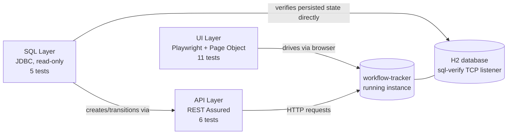

# workflow-tracker-tests

[](https://github.com/frankfulcomer/workflow-tracker-tests/actions/workflows/ci.yml)

A black-box regression suite for [workflow-tracker](https://github.com/frankfulcomer/workflow-tracker)
across three independent testing layers — UI, REST API, and SQL/JDBC —
traceable back to documented Agile acceptance criteria, with its own
cross-repository, exact-commit CI pipeline.

**This repository is the primary artifact of this portfolio project.** The
app under test is a deliberately simple, controllable sandbox; this is
where the QA engineering work actually lives — see **Notable Findings**
below for what that looked like in practice.

## Testing strategy



11 UI + 6 API + 5 SQL = 22 tests total, each traceable to one or more
documented acceptance criteria — a **deliberately selected regression
suite, not an attempt at comprehensive application coverage**. Full
mapping in [`docs/traceability.md`](docs/traceability.md).

## Notable Findings

- **Exploratory testing drove requirement changes.** Manually exercising
  the app while building this suite surfaced server-side contract gaps
  with no written acceptance criterion — what happens on an invalid owner
  id, a blank title, an unassigned item's persisted state. Those became
  new, explicit ACs in `product-stories.md` (WF-006 AC-11/AC-12, WF-001
  AC-9) *before* the corresponding tests were written, not after.
- **A CI-only failure, root-caused rather than patched around.** A UI test
  passed consistently locally but failed consistently in CI. Comparing
  Surefire execution order and log timestamps across environments traced
  it to two back-to-back form submissions racing against the app's async
  submit-handling. Fixed with a synchronization wait in the shared Page
  Object — not in the application, whose underlying hazard was logged to
  the backlog instead — and verified green on both CI paths (direct push
  and cross-repo dispatch).
- **An API error-response gap was documented, not silently fixed.**
  Invalid status values leak an internal Java enum/class name into the
  error response. Logged to the Future Backlog rather than patched
  in-flight, since changing application behavior wasn't in scope for the
  change that found it.
- **SQL verification catches what API/UI checks alone can't.** The SQL
  layer proves persisted state directly — e.g. that a rejected status
  transition truly writes zero history rows, independent of what the
  application's own ORM mapping or JSON serialization reports back.

## Continuous Integration


This repo's CI also runs directly on its own push/PR events. The
`repository_dispatch` path is what guarantees exact-commit testing: the
app's CI fires it only after *its own* build succeeds, carrying that
precise SHA, so the regression suite never tests a later or unrelated
revision than the one that actually triggered it.

## Development and QA Approach

Built with AI assistance (Claude Code) accelerating implementation,
scaffolding, and investigation legwork.

The developer owned requirements and acceptance criteria, exploratory
testing, and final validation throughout. Architecture decisions were
reviewed and approved case by case — for example, REST Assured over
Playwright's own API client, and an opt-in H2 TCP listener over switching
to file-based storage or a real Oracle instance. Code review, and
directing the CI race investigation above to root cause before
authorizing a fix, were handled the same way.

## Application under test

Tests [workflow-tracker](https://github.com/frankfulcomer/workflow-tracker)
as a running black-box service. No dependency on that app's source,
build, or Java classes — not even the SQL layer, which queries the schema
directly over JDBC and never imports the app's repositories or entities.
State changes always go through the app's own UI or API; SQL is read-only
verification.

## Structure

```
src/test/java/com/example/tracker/automation/
  BaseUiTest.java / BaseApiTest.java / sql/BaseSqlTest.java   # per-layer lifecycle & connection setup
  pageobjects/TrackerPage.java     # UI locators + interactions
  api/WorkItemApiClient.java       # thin REST client, returns raw responses
  sql/WorkItemSqlHelper.java       # thin JDBC wrapper, plain parameterized SQL
  tests/
    CreateWorkItemTest.java          # creation, required-title, owner+description (3)
    StatusWorkflowTest.java          # status transitions incl. OPEN (3)
    SearchAndFilterTest.java         # title search, status filter (2)
    WorkItemDetailTest.java          # edit/save, unsaved-change protection, status history (3)
    api/
      WorkItemCreationApiTest.java     # creation contract incl. negative paths (3)
      StatusTransitionApiTest.java     # valid/invalid/no-op transitions (3)
    sql/
      WorkItemPersistenceSqlTest.java  # persisted values, initial history row, owner FK (3)
      StatusTransitionSqlTest.java     # persisted transition outcomes (2)
```

## Traceability

Every test carries a `// WF-00X AC-Y` comment, for example:

```java
// WF-002 AC-14: re-selecting the current status succeeds as a no-op -
// status unchanged, no new history entry.
```

Full mapping: [`docs/traceability.md`](docs/traceability.md).

## Running the suite

Requires Java 17+, Maven, and the Playwright browser binaries (one-time
setup). A running instance of workflow-tracker is required for the UI and
API layers; the SQL layer additionally requires that instance to be
started with `-Dspring-boot.run.profiles=sql-verify`.

```bash
# One-time: install the Playwright browser binaries
mvn exec:java -e -Dexec.mainClass="com.microsoft.playwright.CLI" -Dexec.args="install --with-deps chromium"

mvn test
```

Overrides: `-Dbase.url=` (default `http://localhost:8080`), and for the
SQL layer `-Ddb.url=` / `-Ddb.user=` / `-Ddb.password=` (default the
sql-verify TCP listener: `jdbc:h2:tcp://localhost:9092/mem:trackerdb`,
`sa`, empty).

## Scope

See workflow-tracker's
[`product-stories.md`](https://github.com/frankfulcomer/workflow-tracker/blob/main/docs/product-stories.md)
for the acceptance criteria this suite is built against, what's
explicitly out of scope, and the Future Backlog of deliberately deferred
items — including the two findings above that were logged rather than
fixed.
