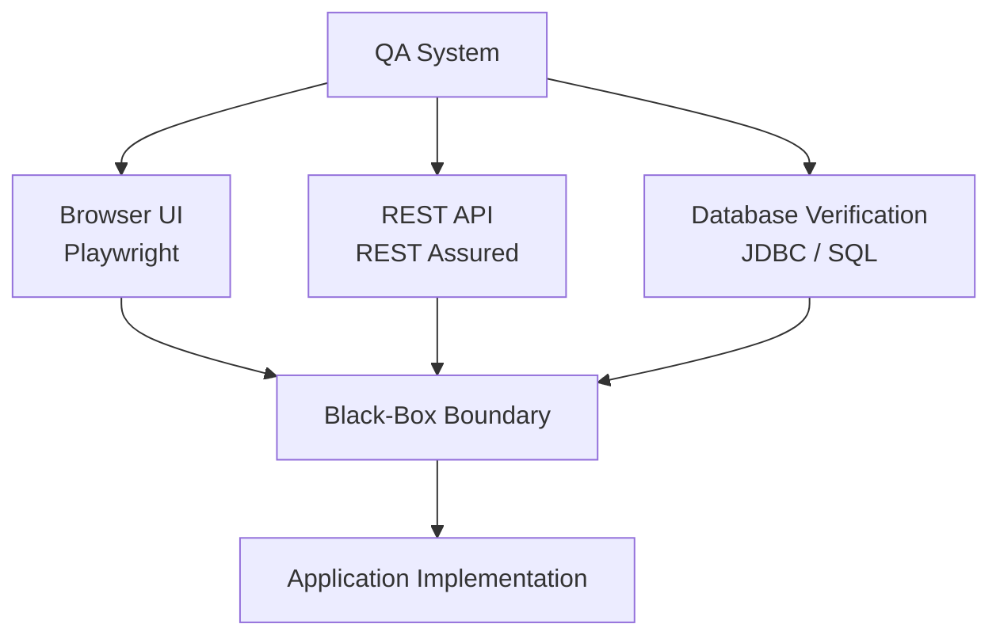
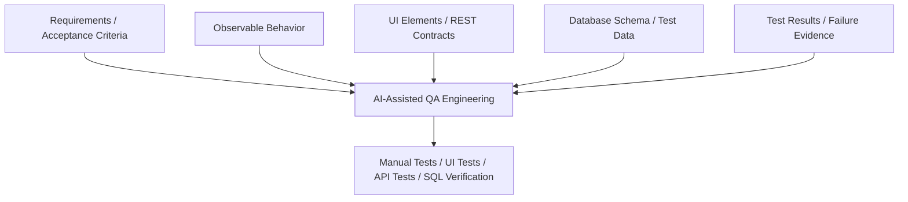
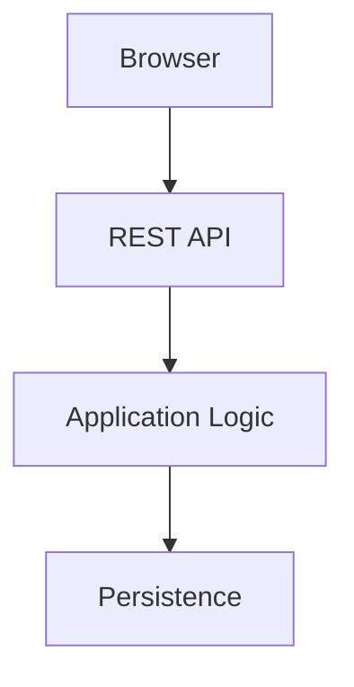
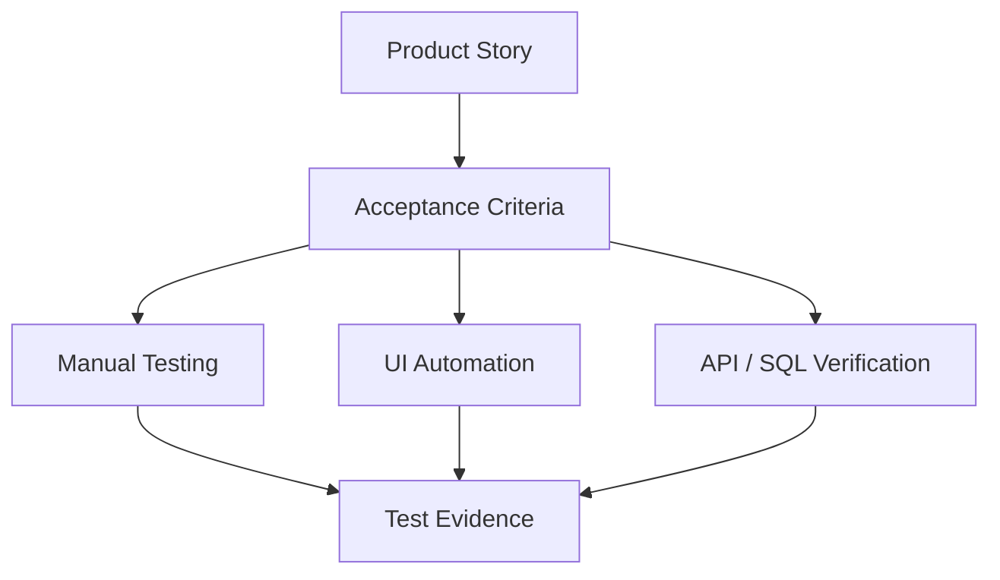
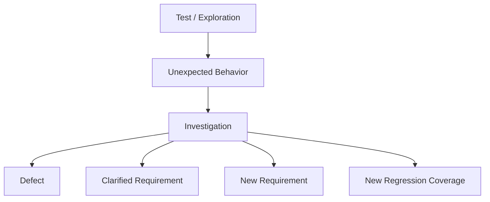
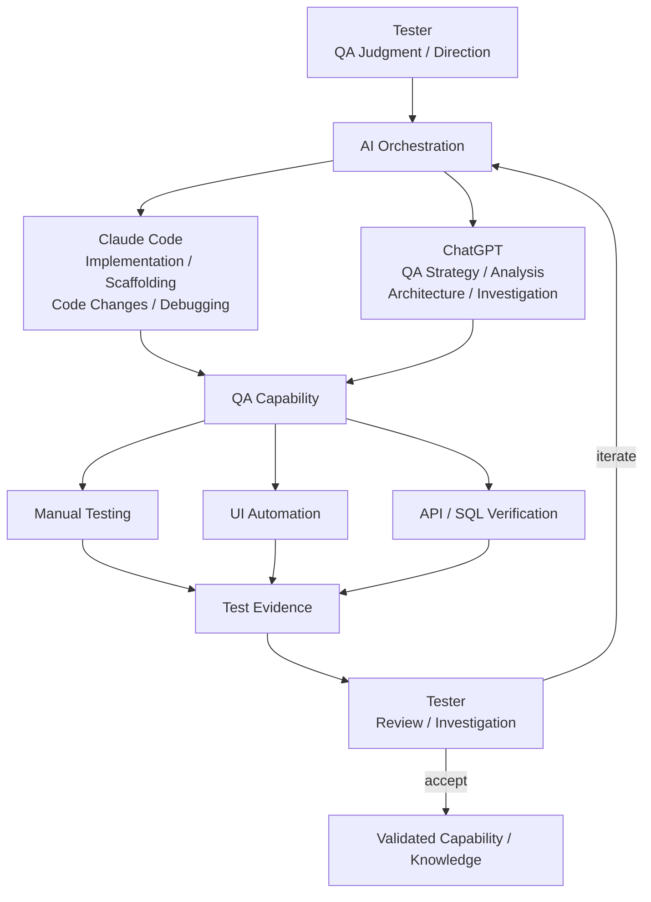
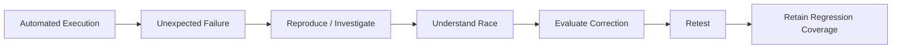

# QA Architecture and Design Decisions

Workflow Tracker Tests was developed using an **AI-assisted QA engineering
process incorporating both Claude Code and ChatGPT**.

The tester acts as the orchestrator of that process: defining the testing
problem, determining what capability is needed, directing implementation and
analysis, evaluating proposed approaches, reviewing results, and deciding what
should be accepted, rejected, or investigated further.

Claude Code and ChatGPT provide complementary forms of assistance across
implementation, investigation, architecture, test analysis, troubleshooting,
documentation, and learning. Architectural and quality decisions remain under
tester review and validation.

This document focuses on those decisions rather than the mechanics of
individual tests.

## Design Goals

The QA architecture is intended to:

- remain independent from application implementation
- verify behavior through observable application boundaries
- support manual and automated testing
- use different testing layers where they provide the best value
- maintain traceability to expected product behavior
- produce repeatable regression evidence
- support continuous integration
- allow AI-assisted development while limiting unnecessary exposure of
  application implementation
- remain understandable and maintainable by a human tester

The technologies are useful only to the extent that they support those goals.

## Black-Box by Design

A central architectural decision was to keep the QA system separate from the
implementation of the application it verifies.

The application and regression system are maintained as separate repositories.

The regression repository does not need to import application entities,
repositories, services, or other internal implementation classes.

State changes are made through the application's externally available UI or
API. SQL access is used for observation and verification rather than to bypass
application behavior and create artificial state.

This produces conventional testing benefits: reduced implementation coupling,
clearer contracts, and a regression system capable of surviving internal
refactoring when externally observable behavior remains unchanged.

It also creates a useful boundary for AI-assisted QA development.

## AI and the Black-Box Boundary

AI-assisted development introduces an additional architectural question:

> **What information does the AI actually need in order to help build useful
> tests?**

For black-box testing, much of that information can come from artifacts other
than application source code:

This does not mean black-box testing makes AI use inherently safe or
eliminates the need for organizational security controls.

Source code is only one category of sensitive information. Production data,
customer information, credentials, logs, configuration, intellectual property,
and other material may also require protection.

The architecture instead follows a principle of **minimum necessary context**:

> **Provide the QA system and its supporting tools with the information needed
> to verify behavior without automatically providing access to everything used
> to implement that behavior.**

This separation is useful whether the assisting tool is AI, another test
framework, an external testing service, or another engineer.

## Layered Verification

The application exposes several places where behavior can be observed.

No single layer is ideal for every test.

The regression architecture therefore deliberately distributes verification
across UI, API, and database layers.

### UI Layer — Playwright

Playwright exercises behavior through a real browser.

UI tests are appropriate when browser interaction itself matters or when a
representative user workflow should be verified from end to end.

Examples include form behavior, navigation, rendering, filtering, user-visible
state, and representative workflows.

Playwright's locator model, automatic waiting, and web-first assertions help
reduce synchronization code and make browser tests easier to reason about.

#### Page Objects

Browser mechanics are separated from test intent through a Page Object Model.

Tests should primarily communicate **what behavior is being verified**.

Page objects handle **how that behavior is performed through the browser**.

This reduces duplication and prevents selectors from becoming scattered
throughout the test suite.

### API Layer — REST Assured

Many business behaviors do not require a browser to verify them.

REST Assured exercises the application's HTTP interfaces directly and provides
a focused layer for testing validation, business rules, state transitions,
error handling, request/response contracts, and input combinations.

Keeping API testing separate from Playwright also prevents browser automation
from becoming the default tool for every testing problem.

The goal is not to eliminate end-to-end testing. It is to reserve it for cases
where end-to-end behavior provides additional confidence.

### Database Layer — JDBC and SQL

Application responses do not always prove what happened to persisted data.

For example, an invalid state transition may correctly return an error while
still accidentally changing a database record or writing an inappropriate
history entry.

SQL verification allows persisted state to be examined directly.

The database layer follows an important constraint:

> **Tests manipulate application state through application interfaces. SQL
> observes the result.**

The QA system therefore does not normally use direct database writes to
manufacture state that bypasses the application's business rules.

This maintains the black-box testing model while allowing stronger persistence
verification.

## Manual Testing Is Part of the Architecture

The presence of automation does not eliminate manual testing.

Manually executable UI, API, and SQL tests provide repeatable procedures while
leaving room for observations that predefined automated assertions may not
capture.

Exploratory testing serves a different purpose. It asks questions such as:

- What happens outside the expected path?
- What assumptions does this requirement make?
- What changes when actions occur in an unexpected order?
- What behavior looks inconsistent even though no assertion currently fails?
- What risk has not yet been represented by a test?

Automation is particularly effective once important behavior is understood
well enough to make a repeatable check valuable.

Exploration helps discover what those important behaviors are.

## Requirements and Traceability

Automation should not exist simply because something can be automated.

The project therefore ties tests to product stories and acceptance criteria.

This provides a way to discuss coverage in terms of expected behavior rather
than number of tests.

It also allows information to flow in the opposite direction. Testing may
reveal that an acceptance criterion is incomplete, ambiguous, incorrect, or
missing entirely.

## AI-Assisted Engineering and Orchestration

AI is deliberately part of the engineering process for this POC, but the
process is not delegated to a single AI system.

The tester coordinates tools with complementary strengths:

- **Claude Code** — repository-level implementation, scaffolding, debugging,
  and iterative code changes
- **ChatGPT** — QA strategy, requirements and test analysis, architecture and
  design review, investigation, technical learning, and evaluation of
  implementation approaches

These are working roles rather than rigid boundaries. The tools can overlap,
challenge an approach, or contribute at different points in the same problem.
The tester determines what problem is being solved, what assistance is useful,
and whether the result is acceptable.

AI can shorten the path from an identified testing need to a candidate
implementation or analysis. It does not remove the requirement to understand
the testing problem, evaluate the proposed solution, execute it, inspect the
evidence, and determine whether the result deserves trust.

The orchestration model is therefore:

> **Testing need → tester direction → AI-assisted implementation and analysis
> → execution → tester evaluation → acceptance or investigation → new
> knowledge**

This allows AI to increase the amount and breadth of work a tester can perform
without transferring ownership of quality decisions to the AI systems.

The public architecture intentionally describes this model at a high level.
The detailed mechanics of tool selection, prompting, handoffs, and validation
are implementation workflow rather than part of the product-facing test
architecture.

## A Real Feedback Loop

The project produced an example of this process while CI was being established.

A UI test passed consistently locally but failed consistently in CI.
Investigation of execution order and timing traced the failure to two
back-to-back form submissions racing against the application's asynchronous
submit handling.

The condition was not intentionally placed in the application as a
demonstration defect.

The testing process exposed it.

AI accelerated portions of the investigation and implementation.

The important QA outcome was not that AI could propose code. It was that the
system produced evidence of unexpected behavior, the behavior was
investigated, and the resulting correction was validated.

> **AI can accelerate implementation and analysis; passing evidence still has
> to earn trust.**

## Continuous Integration

Regression automation becomes more valuable when execution does not depend on
a tester remembering to run it.

GitHub Actions provides repeatable execution and retained evidence.

The application and QA repositories maintain independent lifecycles while
still supporting coordinated regression.

Where application changes trigger the regression system, the exact application
revision under evaluation is identified so that a regression result
corresponds to a known version of the system under test.

The QA repository can also execute independently when the tests themselves
change.

CI therefore provides more than convenience. It helps answer:

> **Exactly what was tested, and what was the result?**

## Technology Decisions

| Technology | Purpose | Architectural Reason |
| --- | --- | --- |
| Java 17 | Test implementation | Common foundation across the automation components |
| Maven | Build/dependency management | Repeatable local and CI execution |
| JUnit 5 | Test framework | Conventional Java test organization and lifecycle |
| Playwright | UI automation | Modern browser automation with automatic waiting and web-first assertions |
| Chromium | Browser target | Repeatable local and headless CI execution |
| REST Assured | API testing | Dedicated HTTP verification independent of the UI layer |
| JDBC | Database verification | Direct SQL access without importing application persistence code |
| SQL | Persistence checks | Proves stored state where UI/API evidence alone is insufficient |
| Page Objects | UI abstraction | Separates test intent from browser mechanics |
| Git | Version control | Traceable changes |
| GitHub | Repository hosting | Independent application and QA repositories |
| GitHub Actions | CI | Repeatable regression execution and retained evidence |
| Surefire | Test results | Standard test-result output suitable for CI artifacts |

## Guiding Principles

1. **Black-box first.** Verify externally observable behavior without
   unnecessary dependency on application implementation.
2. **Minimum necessary context.** Give testing tools — including AI — the
   information needed for the task without automatically exposing unrelated
   proprietary or sensitive material.
3. **Human ownership.** AI can assist implementation and investigation; QA
   judgment remains responsible for defining expected behavior and evaluating
   evidence.
4. **Use the appropriate layer.** Browser automation is valuable, but not every
   test requires a browser.
5. **Application interfaces create state.** Database verification observes
   application behavior rather than bypassing it.
6. **Requirements give tests purpose.** Coverage should be explainable in
   terms of expected behavior rather than test count.
7. **Exploration and automation reinforce each other.** Human investigation
   discovers risk; automation makes understood behavior inexpensive to
   recheck.
8. **Failures are evidence.** Unexpected results should be investigated before
   tests are changed merely to make them pass.
9. **CI is part of QA.** Repeatability, version identification, and retained
   results are part of the test system.
10. **Grow incrementally.** Establish reliable paths and useful coverage before
    pursuing volume.

## Current Direction

The POC continues to evolve as additional testing needs expose architectural
questions.

The objective is not to build the largest possible framework.

It is to build a QA system whose components have clear reasons for existing
and whose results can be understood, investigated, and trusted.
